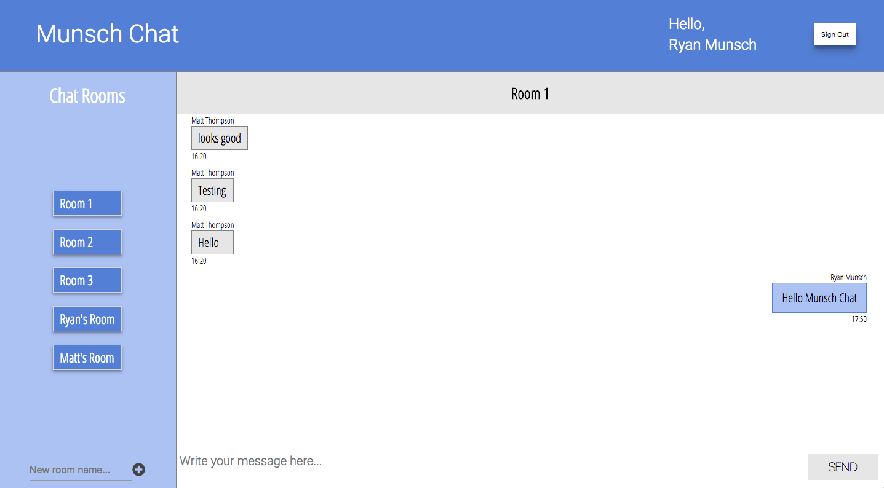

# blocchat-react

Blocchat-react (Munsch Chat) is a messaging app built with React and Firebase. The layout was done primarily with Flexbox. I made this project. during my time as a student at Bloc. The styling was inspired by the principles of Google's Material Design. You can find it deployed [here](https://ancient-inlet-16454.herokuapp.com/).

